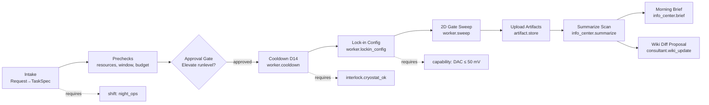
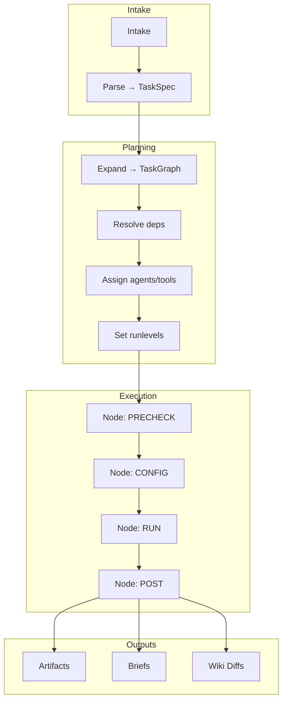
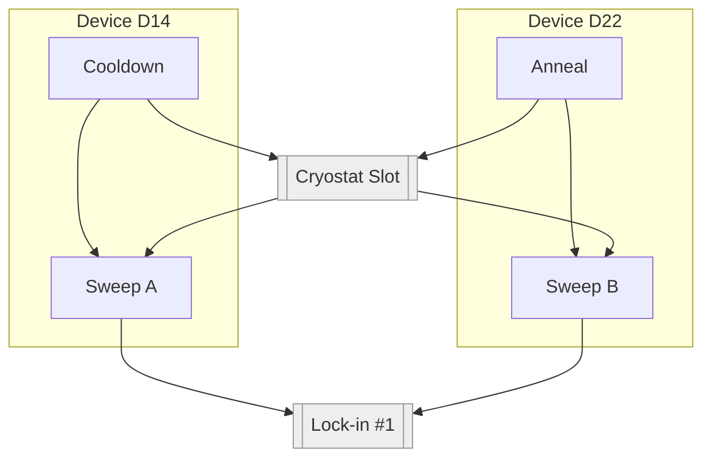

Got it—here are inline visualizations (no canvas).

### 1) Example Task DAG — Overnight Gate-Map (Device D14)



### 2) Generic Planner DAG Template



### 3) Conditional Branches & Retries

```mermaid
graph LR
  A[Start] --> B{Interlocks pass?}
  B -- no --> R1[Auto-remediate]\n--retry--> B
  B -- yes --> C[Configure Instruments]
  C --> D{SNR ≥ threshold?}
  D -- no --> H1[Adjust params]\n--retry--> C
  D -- yes --> E[Run Sweep]
  E --> F[Upload + Index]
  F --> G[Summarize + Notify]
```

### 4) Multi-Device Scheduling with Resource Locks

